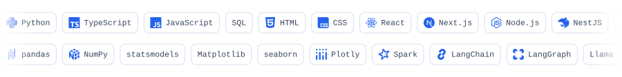

  <picture>
    <source media="(prefers-color-scheme: dark)" srcset="assets/banner-dark.svg">
    
  </picture>

Economist, researcher, software engineer and data scientist. I work in the public sector in
Alagoas, Brazil, where I structure the data and then build the systems that put that
structure in front of real users. Data platforms, ETL over millions of rows, georeferenced
maps, and LLM agents that watch a process and raise an alert the moment a contract rule is
broken.

Most of that code is institutional and lives in private repositories. For the full detail,
see **[lucasfalcao.dev.br](https://lucasfalcao.dev.br)**.

  <picture>
    <source media="(prefers-color-scheme: dark)" srcset="assets/stack-dark.svg">
    
  </picture>

**Research** · I evaluate public policy and measure its causal impact, rather than reporting
the correlation around it.

  <a href="https://lucasfalcao.dev.br" title="lucasfalcao.dev.br"><picture><source media="(prefers-color-scheme: dark)" srcset="assets/btn-site-dark.svg"></picture></a>
  <a href="https://linkedin.com/in/falkzera" title="LinkedIn"><picture><source media="(prefers-color-scheme: dark)" srcset="assets/btn-linkedin-dark.svg"></picture></a>
  <a href="https://www.instagram.com/falkzera/" title="Instagram"><picture><source media="(prefers-color-scheme: dark)" srcset="assets/btn-instagram-dark.svg"></picture></a>
  <a href="http://lattes.cnpq.br/7114371121090791" title="Lattes"><picture><source media="(prefers-color-scheme: dark)" srcset="assets/btn-lattes-dark.svg"></picture></a>
  <a href="https://orcid.org/0009-0007-2130-5697" title="ORCID"><picture><source media="(prefers-color-scheme: dark)" srcset="assets/btn-orcid-dark.svg"></picture></a>
  <a href="mailto:lucasmatheusfalcao@hotmail.com" title="e-mail"><picture><source media="(prefers-color-scheme: dark)" srcset="assets/btn-email-dark.svg"></picture></a>

